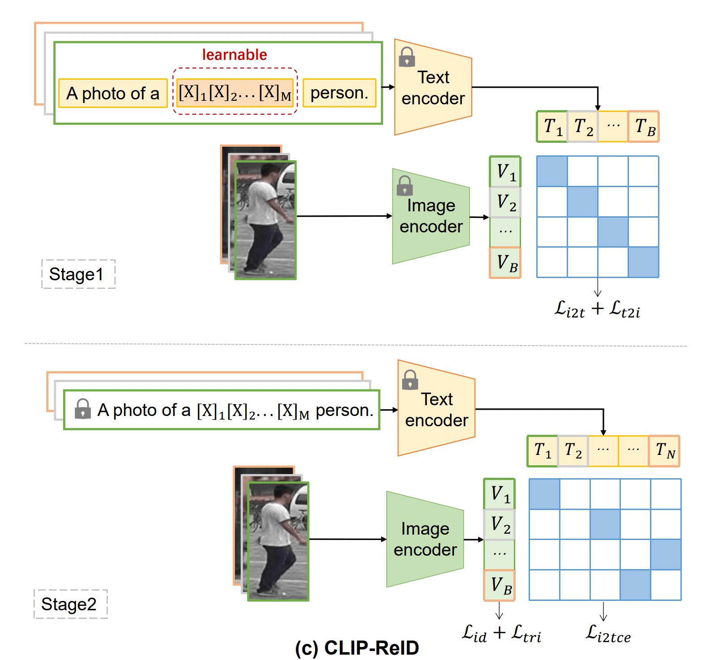

# Реализация ReID модели с помощью CLIP-подобных моделей

## Постановка задачи

В данной работе предлагается улучшить модели задачи реидентификации людей -
распознавание людей с многих камер, то есть нахождение одного и того же человека
на разных камерах (картинках). Улучшать модели можно с помощью использования
текстового описания, который подается на вход вместе с изображением. Именно про
это CLIP-ReID модели. В рамках данной работы будет представлена модель,
распознающая людей, на основе CLIP-ReID. Основная статья -
https://arxiv.org/pdf/2211.13977

## Формат входных и выходных данных

На вход подается батч изображений размера B = P×K (query), где P количество
различных классов людей в батче, и K количество изображений каждого класса.
Также необходимо, чтобы была некоторая галерея изображений среди которых искать
совпадение (galery) формата картинка-лейбл. На выходе для каждого изображения из
query получаем наиболее подходящий label из galery.

## Метрики

- Сumulative matching characteristics (CMC) at Rank-1 (R1)
- Mean average precision (mAP)

Данные метрики выбраны, потому что являются основными в статьях при сравнении с
sota моделями.

На выходе получаем по тестовому датасету следующие метрики:

```
Test Results - Rank-1: 95.19%
Test Results - Rank-5: 98.57%
Test Results - mAP: 88.33%
```

## Валидация

Датасет рандомно разделяется на тренировочный и тестовый в соотношение 1:3 (это
уже проделано в предоставленных датасетах).

## Данные

https://paperswithcode.com/dataset/market-1501 - Market-1501 Статистика:

```
----------------------------------------
subset   | # ids | # images | # cameras
----------------------------------------
train    |   751 |    12936 |         6
query    |   750 |     3368 |         6
gallery  |   751 |    15913 |         6
----------------------------------------
```

## Baseline

Используются полученные метрики в статье

## Основная модель

Модель состоит из двух энкодеров (текстового и для изображений), в основном за
текстовый берут трансформер по типу ViT-B/16, а для изображения ResNet-50. За
основу архитектуры берется CLIP модель. Обучение состоит из двух стадий:

1. Обучаются только текстовые промты
2. Обучается только image encoder На выходе получаем обученный image encoder под
   подставленную задачу, который дальше используется для получения фича вектора
   по изображению 

# Запуск модели

## Характеристики железа

- одна карточка GPU Nvidia GeForce RTX 2080, память 11 Gb
- RAM: 256 Gb
- CPU: Intel Xeon Gold 6136 v4, 24 ядра

## Setup

Скачать репозиторий:

```
git clone https://github.com/anyatamax/reid-task.git
cd reid-task
```

Установить poetry и настроить его конфигурацию, чтобы использовать совместно с
conda:

```
pip install pipx
pipx install poetry
pipx ensurepath

poetry config virtualenvs.path "path_to_your_conda_envs"
poetry config virtualenvs.create false
```

Активировать conda окружение:

```
conda activate <your virtual env name>
```

Установить все зависимости:

```
poetry install
```

## Train

Тренировка модели CLIP-ReID состоит из двух этапов:

1. **Этап 1 (Stage 1)**: Обучение текстовых промтов
2. **Этап 2 (Stage 2)**: Обучение энкодера изображений

### Загрузка данных

Перед началом тренировки необходимо загрузить данные. Это можно сделать
несколькими способами:

1. **Автоматическая загрузка при запуске тренировки**:

   - Данные будут автоматически загружены при запуске скрипта
     `train_clipreid.py`
   - По умолчанию данные загружаются с Google Disk, но если данные уже есть на
     удаленном хранилище DVC, то при проставлении параметра `from_dvc: true`,
     данные загрузятся из DVC

2. **Ручная загрузка данных**:
   - Нужно запустить скрипт загрузки данных напрямую, это скачает датасет и
     дополнительные данные с Google Disk:
     ```
     python utils/download_data.py
     ```
   - Если нужно скачать с DVC, то необходимо выполнить следующие команды:
     ```
     python utils/dvc_utils.py --data_dir=data --dataset_name=additional_files.dvc
     python utils/dvc_utils.py --data_dir=data --dataset_name=Market-1501-v15.09.15.dvc
     ```

### Логирование с MLflow

Для отслеживания процесса обучения используется MLflow. По умолчанию MLflow
сервер запускается по адресу `http://127.0.0.1:8080`. Изменить этот адрес в
можно файле `configs/logging/logging.yaml`.

Для запуска MLflow сервера используется команда :

```
mlflow server --host 127.0.0.1 --port 8080
```

### Запуск тренировки

Для запуска полного процесса тренировки используйте команду:

```
CUDA_VISIBLE_DEVICES=<number of your device> python train_clipreid.py
```

Эта команда выполнит следующие действия:

- Загрузит данные (Market-1501 и дополнительные файлы) с DVC или Google Disk
  (если еще не скачаны)
- Запустит тренировку Stage 1 (если нет сохраненного чекпоинта)
- Запустит тренировку Stage 2 (если нет сохраненного чекпоинта)
- Сохранит модель после каждого этапа

### Параметры тренировки

Параметры тренировки настраиваются через конфигурационные файлы в директории
`configs/`. Основной конфигурационный файл - `configs/config.yaml`.

Основные параметры тренировки:

- **GPU**: Используется ускоритель GPU (`accelerator: gpu`)
- **Precision**: Смешанная точность 16 бит (`precision: 16-mixed`)
- **Devices**: Автоматическое определение доступных устройств (`devices: auto`)
- **Strategy**: Автоматический выбор стратегии распределенного обучения
  (`strategy: auto`)
- **Deterministic**: Детерминированное обучение для воспроизводимости
  результатов (`deterministic: true`)

Также необходимо в конфигах проставить правильные пути до данных:

- В файле `configs/dataset/market1501.yaml` прописать `root_dir` - путь до
  репозитория
- В файле `configs/constants.py` прописать полный путь до BPE токенизатора
  `PATH_TO_BPE`, который лежит в `data/additional_files`

### Пропуск этапов тренировки

Если уже есть сохраненные веса для определенного этапа, этот этап будет
пропущен:

- Если найден файл `model_chkp_name_stage1` (указанный в конфигурации), Stage 1
  будет пропущен, и тренировка начнется с Stage 2
- Если найден файл `model_chkp_name_stage2` (указанный в конфигурации), оба
  этапа будут пропущены

Это позволяет продолжить тренировку с того места, где вы остановились, или
использовать предварительно обученные веса.

### Экспорт модели

Для экспорта модели в формат ONNX после тренировки, нужно установить параметр
`export_to_onnx: true` в конфигурационном файле.

## Production preparation

### Артефакты для запуска модели

Для работы модели в продакшене необходимы следующие артефакты:

- Финальный чекпоинт модели `model_chkp/CLIP-ReID_RN50_final.pth` (или любое
  другое название, которое прописано в `testing/weight`)
- Конфигурационный файл с параметрами модели и препроцессинга
- Скрипт для инференса (`test_clipreid.py`)

Финальный чекпоинт можно получить из репозитория с помощью DVC:

```
dvc pull model_chkp/CLIP-ReID_RN50_final.dvc
```

Или загрузить финальный чекпоинт из Google Disk (используется чекпоинт из
статьи). Для этого нужно проставить флаг `load_from_article: True` в
`testing/cnn_clipreid.yaml`

## Infer

Для запуска инференса на новых данных используйте скрипт `test_clipreid.py`:

```
CUDA_VISIBLE_DEVICES=<number of your device> python test_clipreid.py
```

Этот скрипт:

- Загружает данные для тестирования
- Загружает предобученную модель из указанного в конфигурации пути (если надо
  скачивает модель)
- Выполняет предсказания и выводит метрики (Rank-1, Rank-5, mAP)

Для инференса на собственных данных, данные должны быть организованы в следующем
формате:

- Изображения должны быть размещены в директории, структурированной аналогично
  Market-1501
- Каждое изображение должно иметь формат имени:
  `person_id_camera_id_sequence_id.jpg`

### Инференс модели в продакшене

Данная задача в этой работе не выполняется из-за достаточно сложного инференса:
нужно загрузить в продакшен все изображения из galery и хранить там все время,
далее уже по одной картинке из query посылать на сервис и получать label из
query

# Эксперименты (пока только для Market-1501)

## CNN_CLIP-ReID

### Article
```
Test Results - Rank-1: 95.67% 
Test Results - Rank-5: 98.69%
Test Results - mAP: 89.82%
```
### My
```
Test Results - Rank-1: 95.22%
Test Results - Rank-5: 98.57%
Test Results - mAP: 88.66%
```

### With Graph Sampling 
Использовался алгоритм Graph Sampling https://arxiv.org/pdf/2104.01546 на первой стадии для тектовых фичей.
```
Test Results - Rank-1: 95.67%
Test Results - Rank-5: 98.57%
Test Results - mAP: 89.01%
```

Так же пробовала первые 30 эпох рандомно выбирать батч, а остальные 70 через Graph Sampling. Причем пересчитывать не каждую эпоху, а каждую пятую эпоху
```
Test Results - Rank-1: 95.46%
Test Results - Rank-5: 98.25%
Test Results - mAP: 88.72%
```

Попробовать вместо cosine similarity использовать просто умножение
```
Test Results - Rank-1: 95.46%
Test Results - Rank-5: 98.34%
Test Results - mAP: 89.04%
```

### With captions from CUHK-PEDES 
Использовались текстовые описания из датасета дял тех изображений для которых нашлись, они не тренировались на первой стадии, потому что у таких описаний не было обучаемых токенов. (эмбеддинги не правильно тренить, потому что они тогда заафектят тексы для которых нет caption, как вариант потом добавить к них обучаемые токены) 

Captions in train Stage 1:  3078
Number of images in train Stage 1:  12936 -> нашлось для 23% изображений
```
Test Results - Rank-1: 95.37%
Test Results - Rank-5: 98.43%
Test Results - mAP: 89.50%
```
попробовать на второй раз постоянно перестраивать выбор рандомных
```
Test Results - Rank-1: 95.52%
Test Results - Rank-5: 98.31%
Test Results - mAP: 89.16%
```

## ViT_CLIP-ReID

1) Прогнать все для ViT
2) На других датасетах пообучаться и качество замерить на других